# Snowflake to Kafka CDC - Enterprise Architecture

## 🏗️ System Architecture Overview

The Snowflake to Kafka CDC streaming solution is designed as a high-performance, enterprise-grade data pipeline that provides real-time change data capture from Snowflake streams to Apache Kafka topics.

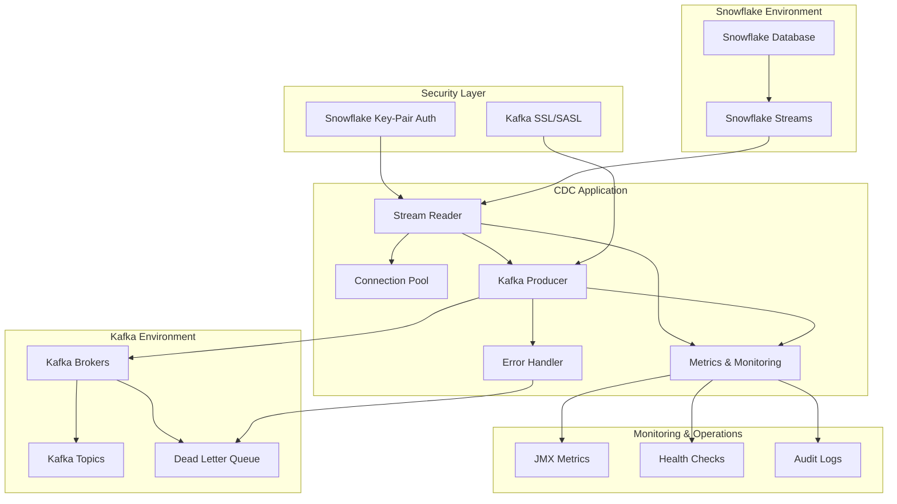

## 🔧 Component Architecture

### 1. Stream Reader Component

**Purpose**: High-performance reading from Snowflake streams with connection pooling and optimization.

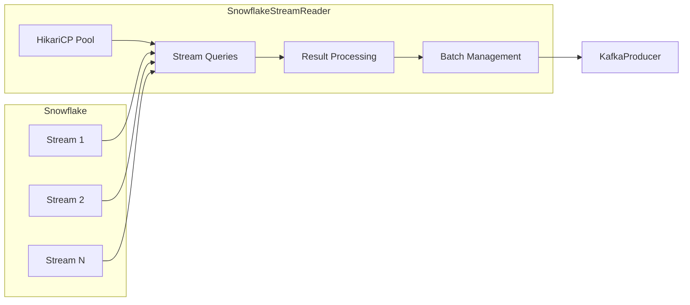

**Key Features**:
- **Connection Pooling**: HikariCP with 20-50 connections
- **Batch Processing**: 10,000-50,000 records per batch
- **Parallel Processing**: Multi-threaded stream reading
- **Query Optimization**: Optimized SQL with fetch size tuning

### 2. Kafka Producer Component

**Purpose**: High-throughput, reliable message publishing to Kafka with enterprise security.

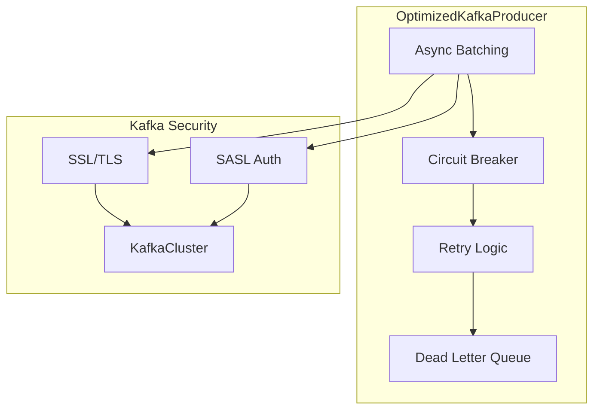

**Key Features**:
- **Async Batching**: 128KB batches with 5ms linger time
- **Circuit Breaker**: Automatic failure detection and recovery
- **Security**: Full SSL/TLS and SASL authentication support
- **Compression**: ZSTD compression for optimal throughput

### 3. Security Architecture

**Purpose**: Enterprise-grade security for both Snowflake and Kafka connections.

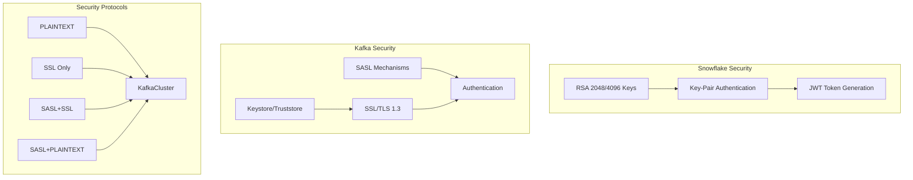

**Security Features**:
- **Snowflake**: RSA key-pair authentication with JWT tokens
- **Kafka**: SSL/TLS 1.3 with client certificates
- **SASL**: PLAIN, SCRAM-SHA-256/512, GSSAPI, OAUTHBEARER
- **Encryption**: End-to-end encryption in transit

## 📊 Data Flow Architecture

### High-Level Data Flow

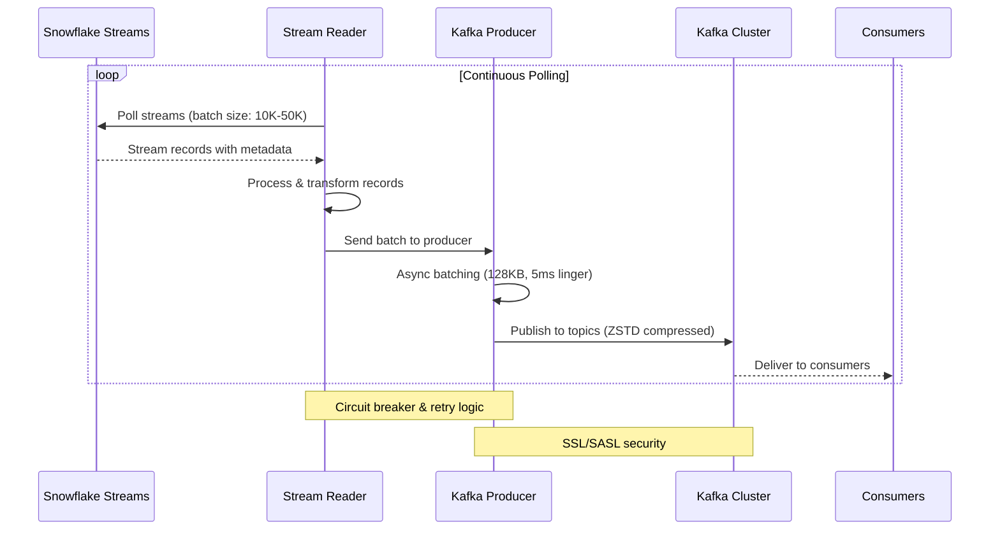

### Detailed Processing Flow

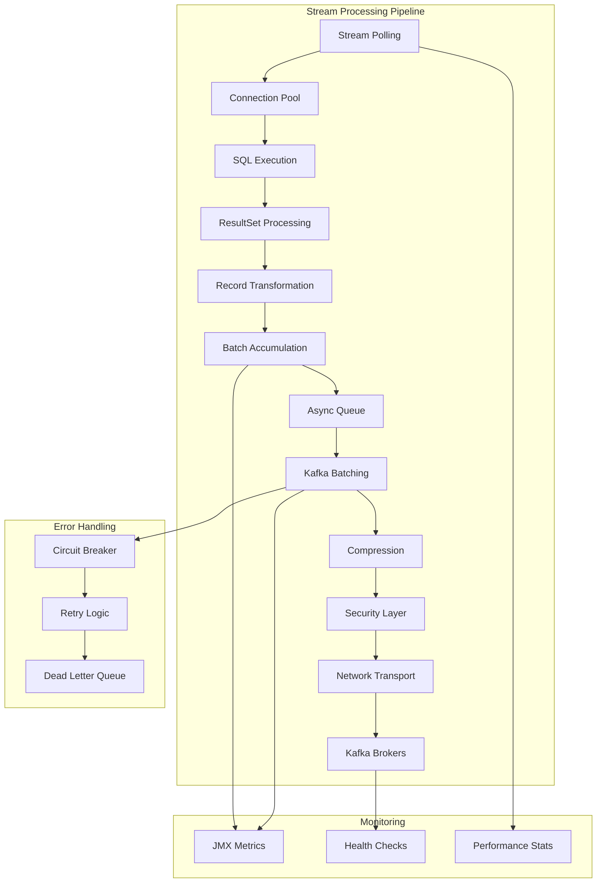

## 🚀 Performance Architecture

### Throughput Optimization

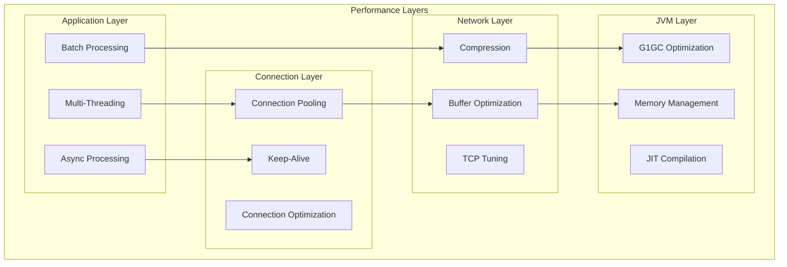

**Performance Targets**:
- **Throughput**: 50,000+ records/second per instance
- **Latency**: <50ms end-to-end processing
- **Memory**: <8GB heap usage under load
- **CPU**: Optimal utilization with 8-32 threads

### Scalability Architecture

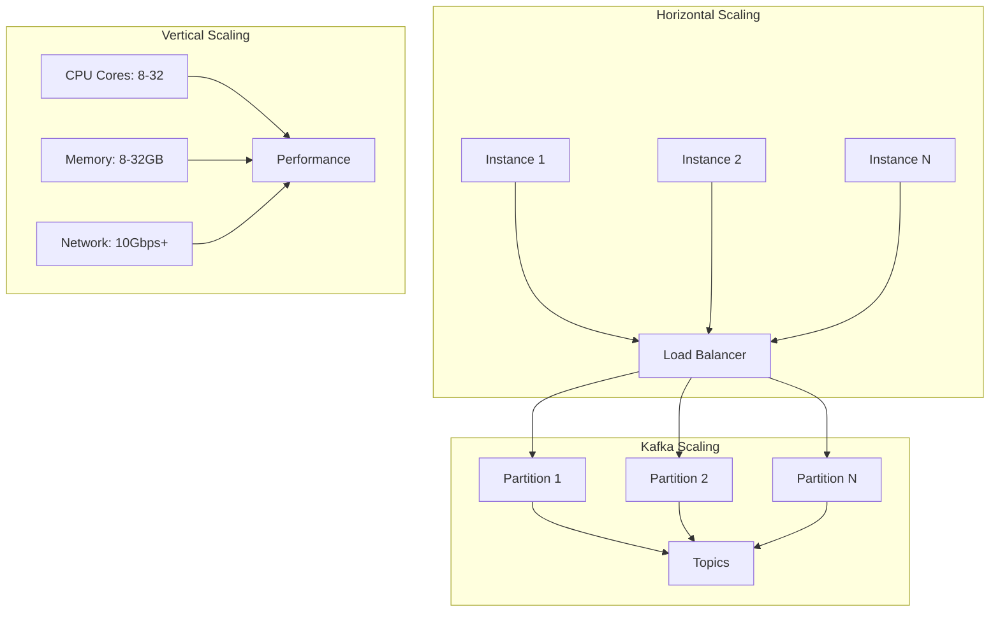

## 🔍 Monitoring Architecture

### Metrics Collection

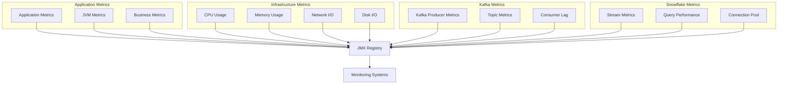

### Health Check Architecture

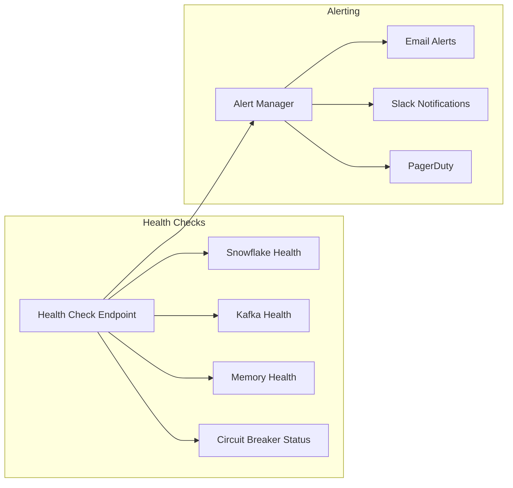

## 🛡️ Security Architecture Details

### Authentication Flow

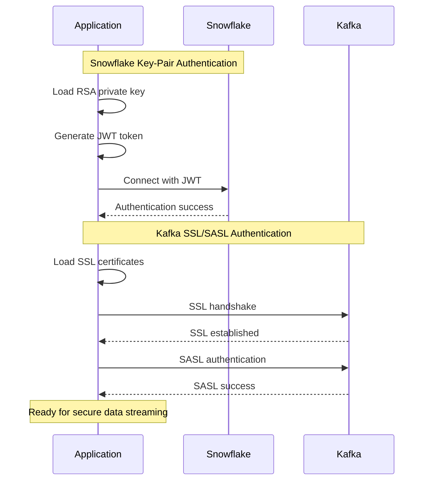

### Certificate Management

```mermaid
graph TB
    subgraph "Certificate Store"
        KS[Keystore (JKS)]
        TS[Truststore (JKS)]
        PK[Private Keys]
        CC[Client Certificates]
        CA[CA Certificates]
        
        KS --> PK
        KS --> CC
        TS --> CA
    end
    
    subgraph "Key Management"
        KG[Key Generation]
        KR[Key Rotation]
        KV[Key Validation]
        
        KG --> KS
        KR --> KS
        KV --> KS
    end
    
    subgraph "Security Policies"
        TLS[TLS 1.3 Only]
        CS[Strong Cipher Suites]
        HV[Hostname Verification]
        
        TLS --> SSL_CONFIG
        CS --> SSL_CONFIG
        HV --> SSL_CONFIG
    end
```

## 🔄 Deployment Architecture

### Container Architecture

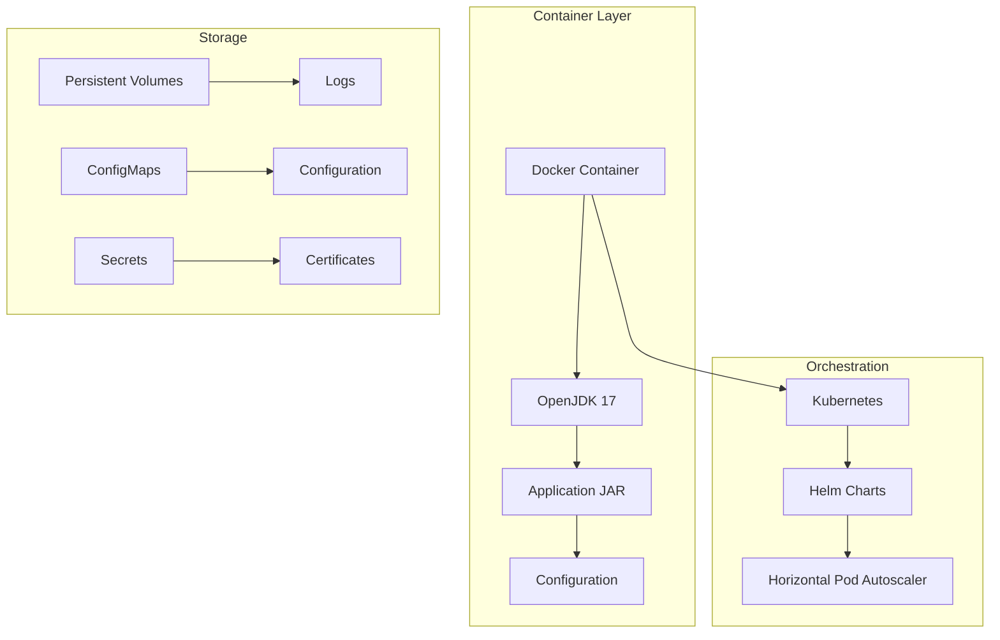

### Network Architecture

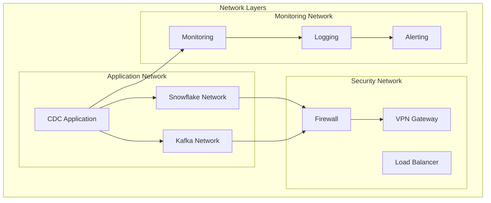

## 📈 Capacity Planning

### Resource Requirements

| Component | CPU | Memory | Network | Storage |
|-----------|-----|---------|---------|---------|
| **Small Deployment** | 4 cores | 8GB | 1Gbps | 100GB |
| **Medium Deployment** | 8 cores | 16GB | 5Gbps | 500GB |
| **Large Deployment** | 16 cores | 32GB | 10Gbps | 1TB |
| **Enterprise Deployment** | 32 cores | 64GB | 25Gbps | 2TB |

### Performance Scaling

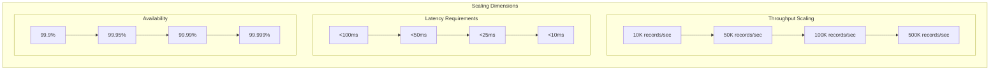

This enterprise architecture provides:
- **High Performance**: 50K+ records/second throughput
- **Enterprise Security**: Full SSL/SASL and key-pair authentication
- **Scalability**: Horizontal and vertical scaling capabilities
- **Reliability**: Circuit breakers, retries, and error handling
- **Observability**: Comprehensive monitoring and alerting
- **Production Ready**: Container deployment with Kubernetes support
