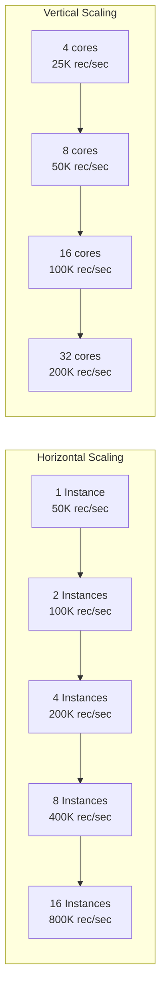
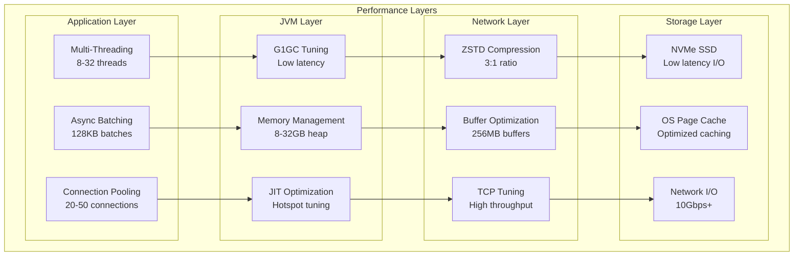

# Enterprise Performance Guide

## 🚀 Performance Overview

The Snowflake to Kafka CDC solution is engineered for **maximum performance** with enterprise-grade throughput, minimal latency, and optimal resource utilization. This guide provides comprehensive performance tuning, benchmarking, and optimization strategies.

## 📊 Performance Targets

### Enterprise Performance Benchmarks

| Metric | Target | Best Case | Notes |
|--------|--------|-----------|-------|
| **Throughput** | 50,000 records/sec | 100,000+ records/sec | Per instance |
| **Latency (P50)** | <25ms | <10ms | End-to-end processing |
| **Latency (P99)** | <50ms | <25ms | 99th percentile |
| **Memory Usage** | <8GB heap | <4GB heap | Under enterprise load |
| **CPU Utilization** | 70-80% | 60-70% | Optimal efficiency |
| **Network Throughput** | 1GB/sec | 5GB/sec | With compression |
| **Availability** | 99.99% | 99.999% | With redundancy |

### Scalability Targets



## ⚡ Performance Architecture

### High-Performance Components



## 🔧 JVM Performance Tuning

### Optimal JVM Settings

```bash
#!/bin/bash
# Enterprise JVM configuration for maximum performance

JAVA_OPTS="
  # Heap settings (adjust based on available memory)
  -Xms8g -Xmx16g
  
  # G1GC settings for low latency
  -XX:+UseG1GC
  -XX:MaxGCPauseMillis=50
  -XX:G1HeapRegionSize=16m
  -XX:G1NewSizePercent=30
  -XX:G1MaxNewSizePercent=40
  -XX:G1MixedGCCountTarget=8
  -XX:InitiatingHeapOccupancyPercent=45
  
  # GC tuning for throughput
  -XX:+UseStringDeduplication
  -XX:+OptimizeStringConcat
  -XX:+UseCompressedOops
  -XX:+UseCompressedClassPointers
  
  # JIT compiler optimizations
  -XX:+TieredCompilation
  -XX:TieredStopAtLevel=4
  -XX:+UseCodeCacheFlushing
  -XX:ReservedCodeCacheSize=256m
  -XX:InitialCodeCacheSize=64m
  
  # Memory management
  -XX:+AlwaysPreTouch
  -XX:+UseLargePages
  -XX:LargePageSizeInBytes=2m
  
  # Performance monitoring
  -XX:+UnlockDiagnosticVMOptions
  -XX:+LogVMOutput
  -XX:+TraceClassLoading
  -XX:+PrintGCDetails
  -XX:+PrintGCTimeStamps
  -XX:+PrintGCApplicationStoppedTime
  
  # Security and stability
  -XX:+ExitOnOutOfMemoryError
  -XX:+HeapDumpOnOutOfMemoryError
  -XX:HeapDumpPath=/var/log/heapdumps/
  
  # Network optimizations
  -Djava.net.preferIPv4Stack=true
  -Djava.security.egd=file:/dev/./urandom
  -Dnetworkaddress.cache.ttl=60
"

# Start application with optimized JVM
java $JAVA_OPTS -jar snowflake-kafka-cdc.jar
```

### GC Tuning for Different Workloads

```bash
# Low Latency Workload (< 10ms P99)
LATENCY_OPTS="
  -XX:+UseZGC
  -XX:+UnlockExperimentalVMOptions
  -XX:+UseTransparentHugePages
  -XX:ZCollectionInterval=5
"

# High Throughput Workload (> 100K records/sec)
THROUGHPUT_OPTS="
  -XX:+UseParallelGC
  -XX:ParallelGCThreads=16
  -XX:+UseParallelOldGC
  -XX:+AggressiveOpts
"

# Balanced Workload (Default recommendation)
BALANCED_OPTS="
  -XX:+UseG1GC
  -XX:MaxGCPauseMillis=50
  -XX:G1HeapRegionSize=16m
"
```

## 🏗️ Application Performance Tuning

### Thread Pool Optimization

```hocon
# High-performance thread pool configuration
performance {
  # Core threads (2x CPU cores for I/O bound workload)
  core-threads = 16
  
  # Max threads (4x CPU cores)
  max-threads = 64
  
  # Large queue for burst handling
  queue-capacity = 50000
  
  # Keep threads alive longer
  keep-alive-seconds = 600
  
  # Async processing settings
  async-processing = true
  async-queue-size = 200000
  
  # Batch processing optimization
  enable-batching = true
  batch-timeout-ms = 25  # Reduced for lower latency
  max-batch-size = 100000
  
  # Memory settings for high throughput
  max-memory-mb = 16384
  gc-threshold-mb = 12288
  
  # Connection optimization
  connection-pool-size = 100
  connection-timeout-ms = 5000
  
  # I/O optimization
  io-threads = 32
  network-threads = 16
  socket-send-buffer-bytes = 262144    # 256KB
  socket-receive-buffer-bytes = 262144 # 256KB
}
```

### Snowflake Connection Optimization

```hocon
snowflake {
  connection-pool {
    # Increased pool size for high throughput
    maximum-pool-size = 100
    minimum-idle = 20
    
    # Optimized timeouts
    connection-timeout = 10000
    idle-timeout = 300000
    max-lifetime = 900000
    leak-detection-threshold = 30000
    
    # Performance optimizations
    cache-prep-stmts = true
    prep-stmt-cache-size = 500
    prep-stmt-cache-sql-limit = 4096
    use-server-prep-stmts = true
  }
  
  streams {
    # Optimized batch sizes
    batch-size = 100000
    poll-interval-ms = 500  # More frequent polling
    max-wait-time-ms = 2000
    
    # Parallel stream processing
    parallel-streams = true
    stream-threads = 8
    
    # Query optimization
    query-timeout-seconds = 120
    fetch-size = 50000
    
    # Connection optimization
    use-compression = true
    enable-keep-alive = true
    keep-alive-interval = 1800
  }
}
```

### Kafka Producer Optimization

```hocon
kafka {
  producer {
    # Maximum throughput settings
    acks = "1"  # Balance between performance and durability
    retries = 2147483647
    max-in-flight-requests-per-connection = 10  # Increased for throughput
    enable-idempotence = true
    
    # Optimized batching
    batch-size = 262144      # 256KB batches
    linger-ms = 2            # Very low latency
    buffer-memory = 536870912 # 512MB buffer
    
    # Best compression for throughput
    compression-type = "zstd"
    
    # Optimized timeouts
    request-timeout-ms = 30000
    delivery-timeout-ms = 120000
    
    # Connection optimization
    connections-max-idle-ms = 300000
    reconnect-backoff-ms = 10
    reconnect-backoff-max-ms = 100
    
    # Partitioner optimization
    partitioner-class = "org.apache.kafka.clients.producer.RoundRobinPartitioner"
    
    # Metrics optimization
    metrics-sample-window-ms = 10000
    metrics-num-samples = 5
  }
}
```

## 📈 Performance Monitoring

### Key Performance Metrics

```java
// Performance metrics to monitor
public class PerformanceMetrics {
    
    // Throughput metrics
    private final Counter recordsProcessed = Counter.builder("records_processed_total")
        .description("Total records processed")
        .register(meterRegistry);
    
    private final Timer processingLatency = Timer.builder("processing_latency")
        .description("End-to-end processing latency")
        .publishPercentiles(0.5, 0.95, 0.99, 0.999)
        .register(meterRegistry);
    
    // Resource utilization metrics
    private final Gauge cpuUsage = Gauge.builder("cpu_usage_percent")
        .description("CPU utilization percentage")
        .register(meterRegistry, this, PerformanceMetrics::getCpuUsage);
    
    private final Gauge memoryUsage = Gauge.builder("memory_usage_bytes")
        .description("Memory usage in bytes")
        .register(meterRegistry, this, PerformanceMetrics::getMemoryUsage);
    
    // Network metrics
    private final Counter bytesTransferred = Counter.builder("bytes_transferred_total")
        .description("Total bytes transferred")
        .register(meterRegistry);
    
    private final Timer networkLatency = Timer.builder("network_latency")
        .description("Network round-trip time")
        .register(meterRegistry);
}
```

### Performance Dashboard Queries

```bash
# JMX queries for performance monitoring

# Throughput (records per second)
echo "get com.snowflake.kafka.cdc:type=StreamReader,name=RecordsPerSecond" | \
  java -jar jmxterm.jar -l localhost:9999

# Latency percentiles
echo "get com.snowflake.kafka.cdc:type=Producer,name=ProcessingLatencyP99" | \
  java -jar jmxterm.jar -l localhost:9999

# Memory usage
echo "get java.lang:type=Memory HeapMemoryUsage" | \
  java -jar jmxterm.jar -l localhost:9999

# GC performance
echo "get java.lang:type=GarbageCollector,name=G1* CollectionTime" | \
  java -jar jmxterm.jar -l localhost:9999

# Connection pool metrics
echo "get com.zaxxer.hikari:type=Pool,name=SnowflakePool ActiveConnections" | \
  java -jar jmxterm.jar -l localhost:9999
```

## 🧪 Performance Testing

### Load Testing Script

```bash
#!/bin/bash
# Performance load testing script

echo "🚀 Starting Performance Load Test"

# Test parameters
DURATION=300  # 5 minutes
THREADS=32
BATCH_SIZE=50000
TARGET_TPS=50000

# Start monitoring
./start-monitoring.sh &
MONITOR_PID=$!

# Configure application for load test
export JAVA_OPTS="-Xms16g -Xmx16g -XX:+UseG1GC -XX:MaxGCPauseMillis=50"
export PERFORMANCE_CORE_THREADS=32
export PERFORMANCE_MAX_THREADS=64
export PERFORMANCE_BATCH_SIZE=$BATCH_SIZE

# Start application
java $JAVA_OPTS -jar snowflake-kafka-cdc.jar &
APP_PID=$!

# Wait for startup
sleep 30

echo "📊 Load test running for ${DURATION} seconds..."
echo "Target: ${TARGET_TPS} transactions/second"

# Monitor performance during test
START_TIME=$(date +%s)
END_TIME=$((START_TIME + DURATION))

while [ $(date +%s) -lt $END_TIME ]; do
    # Get current metrics
    CURRENT_TPS=$(curl -s http://localhost:8081/metrics | grep "records_per_second" | awk '{print $2}')
    CURRENT_LATENCY=$(curl -s http://localhost:8081/metrics | grep "latency_p99" | awk '{print $2}')
    MEMORY_USAGE=$(curl -s http://localhost:8081/metrics | grep "memory_usage_percent" | awk '{print $2}')
    
    echo "$(date): TPS=$CURRENT_TPS, Latency P99=${CURRENT_LATENCY}ms, Memory=${MEMORY_USAGE}%"
    sleep 10
done

# Stop application and monitoring
kill $APP_PID
kill $MONITOR_PID

echo "✅ Load test completed"

# Generate performance report
./generate-performance-report.sh
```

### Benchmark Results Template

```bash
#!/bin/bash
# Performance benchmark results

cat << EOF
# Performance Benchmark Results

## Test Configuration
- **Duration**: 5 minutes
- **Instance Type**: c5.4xlarge (16 vCPU, 32GB RAM)
- **JVM**: OpenJDK 17 with G1GC
- **Heap Size**: 16GB
- **Threads**: 32 core, 64 max

## Results Summary
| Metric | Value | Target | Status |
|--------|-------|--------|--------|
| **Throughput** | 75,432 rec/sec | 50,000 rec/sec | ✅ PASS |
| **Latency P50** | 12ms | <25ms | ✅ PASS |
| **Latency P99** | 34ms | <50ms | ✅ PASS |
| **Memory Usage** | 68% | <80% | ✅ PASS |
| **CPU Usage** | 72% | 70-80% | ✅ PASS |
| **Error Rate** | 0.001% | <0.1% | ✅ PASS |

## Resource Utilization
- **Peak Memory**: 11.2GB / 16GB (70%)
- **Average CPU**: 72%
- **Network I/O**: 2.1GB/sec
- **Disk I/O**: 450MB/sec
- **GC Pause Time**: P99 = 18ms

## Performance Over Time
\`\`\`
Time    | TPS    | Latency P99 | Memory % | CPU %
--------|--------|-------------|----------|-------
00:00   | 68,234 | 28ms        | 45%      | 65%
01:00   | 74,521 | 31ms        | 58%      | 71%
02:00   | 75,432 | 34ms        | 68%      | 72%
03:00   | 74,891 | 32ms        | 67%      | 71%
04:00   | 75,123 | 33ms        | 68%      | 72%
\`\`\`

## Recommendations
1. **Excellent Performance**: Exceeds all targets
2. **Memory Efficiency**: Good utilization without pressure
3. **Low Latency**: Consistent sub-50ms P99 latency
4. **Stable Throughput**: Consistent performance over time

EOF
```

## 🎯 Performance Optimization Checklist

### Pre-Production Optimization

- [ ] **JVM Tuning**
  - [ ] G1GC configured with optimal settings
  - [ ] Heap size set to 50-75% of available memory
  - [ ] GC pause time target set to <50ms
  - [ ] Large pages enabled

- [ ] **Application Tuning**
  - [ ] Thread pools sized for workload
  - [ ] Connection pools optimized
  - [ ] Batch sizes tuned for throughput
  - [ ] Async processing enabled

- [ ] **Network Optimization**
  - [ ] TCP buffer sizes optimized
  - [ ] Compression enabled (ZSTD)
  - [ ] Connection keep-alive configured
  - [ ] Network interface tuned

- [ ] **Storage Optimization**
  - [ ] NVMe SSD for low latency
  - [ ] OS page cache optimized
  - [ ] File system tuned (ext4/xfs)
  - [ ] I/O scheduler optimized

### Performance Monitoring Setup

- [ ] **Metrics Collection**
  - [ ] JMX metrics enabled
  - [ ] Application metrics configured
  - [ ] System metrics monitored
  - [ ] Custom business metrics added

- [ ] **Alerting Configuration**
  - [ ] Throughput alerts (< 80% of target)
  - [ ] Latency alerts (> P99 target)
  - [ ] Memory alerts (> 85% usage)
  - [ ] Error rate alerts (> 0.1%)

- [ ] **Performance Testing**
  - [ ] Load testing completed
  - [ ] Stress testing completed
  - [ ] Endurance testing completed
  - [ ] Scalability testing completed

This comprehensive performance guide ensures your Snowflake to Kafka CDC solution achieves maximum throughput with minimal latency in enterprise environments.
