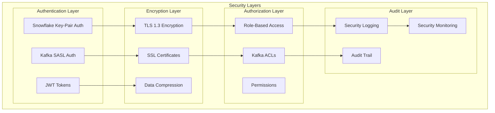

# Enterprise Security Guide

## 🔐 Security Overview

The Snowflake to Kafka CDC solution implements enterprise-grade security across all components, ensuring data protection in transit and at rest, authentication, authorization, and comprehensive audit capabilities.

## 🏗️ Security Architecture



## 🔑 Snowflake Key-Pair Authentication

### Overview

Snowflake key-pair authentication provides the highest level of security by using RSA public-private key pairs instead of passwords. This eliminates password-based vulnerabilities and provides non-repudiation.

### Key Generation

```bash
# Generate RSA private key (2048-bit minimum, 4096-bit recommended)
openssl genrsa -out snowflake_private_key.pem 4096

# Generate public key from private key
openssl rsa -in snowflake_private_key.pem -pubout -out snowflake_public_key.pem

# Generate encrypted private key (recommended for production)
openssl genrsa -aes256 -out snowflake_private_key_encrypted.pem 4096
```

### Snowflake User Setup

```sql
-- Create user with public key authentication
CREATE USER kafka_cdc_user
  RSA_PUBLIC_KEY='MIIBIjANBgkqhkiG9w0BAQEFAAOCAQ8AMIIBCgKCAQEA...'
  DEFAULT_ROLE='CDC_ROLE'
  DEFAULT_WAREHOUSE='CDC_WAREHOUSE'
  MUST_CHANGE_PASSWORD=FALSE;

-- Grant necessary privileges
GRANT ROLE CDC_ROLE TO USER kafka_cdc_user;
GRANT USAGE ON WAREHOUSE CDC_WAREHOUSE TO ROLE CDC_ROLE;
GRANT USAGE ON DATABASE CDC_DATABASE TO ROLE CDC_ROLE;
GRANT USAGE ON SCHEMA CDC_DATABASE.CDC_SCHEMA TO ROLE CDC_ROLE;
GRANT SELECT ON ALL STREAMS IN SCHEMA CDC_DATABASE.CDC_SCHEMA TO ROLE CDC_ROLE;

-- Verify user setup
DESC USER kafka_cdc_user;
```

### Application Configuration

```hocon
snowflake {
  account = "your-account"
  user = "kafka_cdc_user"
  auth-method = "keypair"
  private-key-path = "/secure/path/snowflake_private_key.pem"
  private-key-passphrase = ${?SNOWFLAKE_KEY_PASSPHRASE}
  warehouse = "CDC_WAREHOUSE"
  database = "CDC_DATABASE"
  schema = "CDC_SCHEMA"
  role = "CDC_ROLE"
}
```

### Security Best Practices

1. **Key Storage**:
   - Store private keys in secure key management systems (AWS KMS, HashiCorp Vault)
   - Use encrypted private keys with strong passphrases
   - Implement key rotation policies (every 90-180 days)

2. **Access Control**:
   - Limit file system permissions (600 for private keys)
   - Use dedicated service accounts
   - Implement least privilege access

3. **Monitoring**:
   - Log all authentication attempts
   - Monitor for unusual access patterns
   - Set up alerts for authentication failures

## 🔒 Kafka Security Configuration

### SSL/TLS Configuration

#### Certificate Generation

```bash
# Create Certificate Authority (CA)
openssl req -new -x509 -keyout ca-key -out ca-cert -days 3650 -subj "/CN=KafkaCA"

# Create server keystore
keytool -keystore kafka.server.keystore.jks -alias localhost -validity 3650 -genkey \
  -keyalg RSA -keysize 4096 -dname "CN=kafka-broker,OU=IT,O=Company,L=City,ST=State,C=US"

# Create certificate signing request
keytool -keystore kafka.server.keystore.jks -alias localhost -certreq -file cert-file

# Sign the certificate
openssl x509 -req -CA ca-cert -CAkey ca-key -in cert-file -out cert-signed -days 3650 -CAcreateserial

# Import CA certificate into keystore
keytool -keystore kafka.server.keystore.jks -alias CARoot -import -file ca-cert

# Import signed certificate into keystore
keytool -keystore kafka.server.keystore.jks -alias localhost -import -file cert-signed

# Create client truststore
keytool -keystore kafka.client.truststore.jks -alias CARoot -import -file ca-cert

# Create client keystore (for mutual TLS)
keytool -keystore kafka.client.keystore.jks -alias client -validity 3650 -genkey \
  -keyalg RSA -keysize 4096 -dname "CN=kafka-client,OU=IT,O=Company,L=City,ST=State,C=US"
```

#### Application SSL Configuration

```hocon
kafka {
  bootstrap-servers = "kafka-broker:9093"
  
  security {
    protocol = "SSL"
    
    ssl {
      keystore-location = "/secure/certs/kafka.client.keystore.jks"
      keystore-password = ${KAFKA_KEYSTORE_PASSWORD}
      truststore-location = "/secure/certs/kafka.client.truststore.jks"
      truststore-password = ${KAFKA_TRUSTSTORE_PASSWORD}
      enable-hostname-verification = true
    }
  }
}
```

### SASL Authentication

#### SASL/PLAIN Configuration

```hocon
kafka {
  security {
    protocol = "SASL_SSL"
    
    sasl {
      mechanism = "PLAIN"
      username = ${KAFKA_SASL_USERNAME}
      password = ${KAFKA_SASL_PASSWORD}
    }
    
    ssl {
      truststore-location = "/secure/certs/kafka.client.truststore.jks"
      truststore-password = ${KAFKA_TRUSTSTORE_PASSWORD}
    }
  }
}
```

#### SASL/SCRAM Configuration

```hocon
kafka {
  security {
    protocol = "SASL_SSL"
    
    sasl {
      mechanism = "SCRAM-SHA-256"
      username = ${KAFKA_SASL_USERNAME}
      password = ${KAFKA_SASL_PASSWORD}
    }
  }
}
```

#### SASL/GSSAPI (Kerberos) Configuration

```hocon
kafka {
  security {
    protocol = "SASL_SSL"
    
    sasl {
      mechanism = "GSSAPI"
      jaas-config = """
        com.sun.security.auth.module.Krb5LoginModule required
        useKeyTab=true
        storeKey=true
        keyTab="/secure/keytabs/kafka-client.keytab"
        principal="kafka-client@REALM.COM";
      """
    }
  }
}
```

## 🛡️ Network Security

### Firewall Configuration

```bash
# Snowflake connections (HTTPS)
iptables -A OUTPUT -p tcp --dport 443 -d snowflake-account.snowflakecomputing.com -j ACCEPT

# Kafka connections (SSL)
iptables -A OUTPUT -p tcp --dport 9093 -d kafka-broker -j ACCEPT

# JMX monitoring (if enabled)
iptables -A INPUT -p tcp --dport 9999 -s monitoring-server -j ACCEPT

# Health check endpoint
iptables -A INPUT -p tcp --dport 8081 -s load-balancer -j ACCEPT

# Block all other traffic
iptables -A INPUT -j DROP
iptables -A OUTPUT -j DROP
```

### VPN/Private Network Setup

```yaml
# Example AWS VPC configuration
apiVersion: v1
kind: ConfigMap
metadata:
  name: network-config
data:
  vpc-cidr: "10.0.0.0/16"
  private-subnet-1: "10.0.1.0/24"
  private-subnet-2: "10.0.2.0/24"
  security-groups: |
    - name: kafka-cdc-sg
      rules:
        - protocol: tcp
          port: 9093
          source: 10.0.0.0/16
        - protocol: tcp
          port: 443
          destination: 0.0.0.0/0
```

## 🔍 Security Monitoring & Auditing

### Security Event Logging

```java
// Security audit logger configuration
public class SecurityAuditLogger {
    private static final Logger securityLogger = 
        LoggerFactory.getLogger("SECURITY_AUDIT");
    
    public void logAuthenticationAttempt(String user, String source, boolean success) {
        securityLogger.info("AUTH_ATTEMPT user={} source={} success={} timestamp={}", 
            user, source, success, Instant.now());
    }
    
    public void logDataAccess(String user, String resource, String action) {
        securityLogger.info("DATA_ACCESS user={} resource={} action={} timestamp={}", 
            user, resource, action, Instant.now());
    }
    
    public void logSecurityViolation(String violation, String details) {
        securityLogger.warn("SECURITY_VIOLATION type={} details={} timestamp={}", 
            violation, details, Instant.now());
    }
}
```

### Security Metrics

```java
// Security metrics collection
public class SecurityMetrics {
    private final Counter authFailures = Counter.builder("auth_failures_total")
        .description("Total authentication failures")
        .register(meterRegistry);
    
    private final Counter securityViolations = Counter.builder("security_violations_total")
        .description("Total security violations")
        .register(meterRegistry);
    
    private final Timer authenticationTime = Timer.builder("authentication_duration")
        .description("Authentication duration")
        .register(meterRegistry);
}
```

### Intrusion Detection

```bash
#!/bin/bash
# Security monitoring script

# Monitor failed authentication attempts
tail -f /var/log/snowflake-kafka-cdc/security.log | grep "AUTH_ATTEMPT.*success=false" | \
while read line; do
    # Extract IP and increment counter
    ip=$(echo $line | grep -oP 'source=\K[^[:space:]]+')
    
    # Alert if more than 5 failures in 5 minutes
    if [ $(grep -c "$ip.*success=false" /tmp/auth_failures_$(date +%M)) -gt 5 ]; then
        echo "ALERT: Multiple authentication failures from $ip" | \
        mail -s "Security Alert" security@company.com
    fi
done
```

## 🔐 Data Protection

### Encryption in Transit

All data transmission is encrypted using:

1. **Snowflake**: TLS 1.3 with strong cipher suites
2. **Kafka**: SSL/TLS 1.3 with client certificates
3. **Monitoring**: HTTPS for all endpoints

### Encryption at Rest

```yaml
# Kubernetes secret for sensitive data
apiVersion: v1
kind: Secret
metadata:
  name: kafka-cdc-secrets
type: Opaque
data:
  snowflake-private-key: <base64-encoded-key>
  kafka-keystore-password: <base64-encoded-password>
  kafka-truststore-password: <base64-encoded-password>
```

### Data Masking & Anonymization

```sql
-- Snowflake data masking policies
CREATE MASKING POLICY email_mask AS (val string) RETURNS string ->
  CASE
    WHEN CURRENT_ROLE() IN ('CDC_ROLE') THEN val
    ELSE REGEXP_REPLACE(val, '.+@', '*****@')
  END;

-- Apply masking policy
ALTER TABLE customers MODIFY COLUMN email SET MASKING POLICY email_mask;

-- Row access policy
CREATE ROW ACCESS POLICY customer_policy AS (customer_region string) RETURNS boolean ->
  CASE
    WHEN CURRENT_ROLE() = 'GLOBAL_ADMIN' THEN TRUE
    WHEN CURRENT_ROLE() = 'US_ADMIN' AND customer_region = 'US' THEN TRUE
    ELSE FALSE
  END;

ALTER TABLE customers ADD ROW ACCESS POLICY customer_policy ON (region);
```

## 🚨 Incident Response

### Security Incident Playbook

1. **Detection**:
   - Automated alerts from security monitoring
   - Manual detection through log analysis
   - External threat intelligence

2. **Containment**:
   ```bash
   # Immediately disable compromised user
   snowsql -c myconnection -q "ALTER USER suspicious_user SET DISABLED = TRUE;"
   
   # Block suspicious IP addresses
   iptables -A INPUT -s suspicious_ip -j DROP
   
   # Rotate compromised keys
   ./rotate-keys.sh --emergency
   ```

3. **Investigation**:
   ```bash
   # Analyze security logs
   grep "suspicious_user" /var/log/snowflake-kafka-cdc/security.log
   
   # Check access patterns
   grep "DATA_ACCESS" /var/log/snowflake-kafka-cdc/audit.log | grep "suspicious_user"
   
   # Verify data integrity
   ./verify-data-integrity.sh
   ```

4. **Recovery**:
   - Restore from clean backups if necessary
   - Update security policies
   - Patch vulnerabilities

5. **Lessons Learned**:
   - Document incident details
   - Update security procedures
   - Conduct security training

### Emergency Procedures

```bash
#!/bin/bash
# Emergency security lockdown script

echo "🚨 EMERGENCY SECURITY LOCKDOWN INITIATED"

# Stop all CDC processes
pkill -f "snowflake-kafka-cdc"

# Block all external connections
iptables -P INPUT DROP
iptables -P OUTPUT DROP
iptables -P FORWARD DROP

# Disable all service accounts
snowsql -c admin -q "
  ALTER USER kafka_cdc_user SET DISABLED = TRUE;
  ALTER USER kafka_producer_user SET DISABLED = TRUE;
"

# Rotate all keys immediately
./emergency-key-rotation.sh

# Send alert to security team
echo "Emergency lockdown activated at $(date)" | \
mail -s "🚨 SECURITY LOCKDOWN" security@company.com

echo "✅ Emergency lockdown complete. Manual intervention required."
```

## 📋 Security Checklist

### Pre-Production Security Review

- [ ] **Authentication**
  - [ ] Snowflake key-pair authentication configured
  - [ ] Kafka SASL/SSL authentication enabled
  - [ ] Strong passwords/passphrases used
  - [ ] Service accounts properly configured

- [ ] **Encryption**
  - [ ] TLS 1.3 enabled for all connections
  - [ ] Strong cipher suites configured
  - [ ] Certificate validation enabled
  - [ ] Data compression enabled

- [ ] **Access Control**
  - [ ] Least privilege principle applied
  - [ ] Role-based access control implemented
  - [ ] Network access restrictions in place
  - [ ] Firewall rules configured

- [ ] **Monitoring**
  - [ ] Security logging enabled
  - [ ] Audit trails configured
  - [ ] Intrusion detection active
  - [ ] Security metrics collected

- [ ] **Key Management**
  - [ ] Keys stored securely
  - [ ] Key rotation procedures defined
  - [ ] Emergency key rotation tested
  - [ ] Key backup and recovery tested

- [ ] **Compliance**
  - [ ] Data masking policies applied
  - [ ] Row-level security configured
  - [ ] Audit requirements met
  - [ ] Regulatory compliance verified

### Ongoing Security Maintenance

- [ ] **Daily**
  - [ ] Review security logs
  - [ ] Check authentication failures
  - [ ] Monitor security metrics
  - [ ] Verify system health

- [ ] **Weekly**
  - [ ] Security vulnerability scan
  - [ ] Access review
  - [ ] Certificate expiration check
  - [ ] Backup verification

- [ ] **Monthly**
  - [ ] Security policy review
  - [ ] Incident response drill
  - [ ] Security training update
  - [ ] Compliance audit

- [ ] **Quarterly**
  - [ ] Key rotation
  - [ ] Security architecture review
  - [ ] Penetration testing
  - [ ] Security metrics analysis

This comprehensive security implementation ensures enterprise-grade protection for your Snowflake to Kafka CDC pipeline with defense-in-depth strategies, continuous monitoring, and incident response capabilities.
